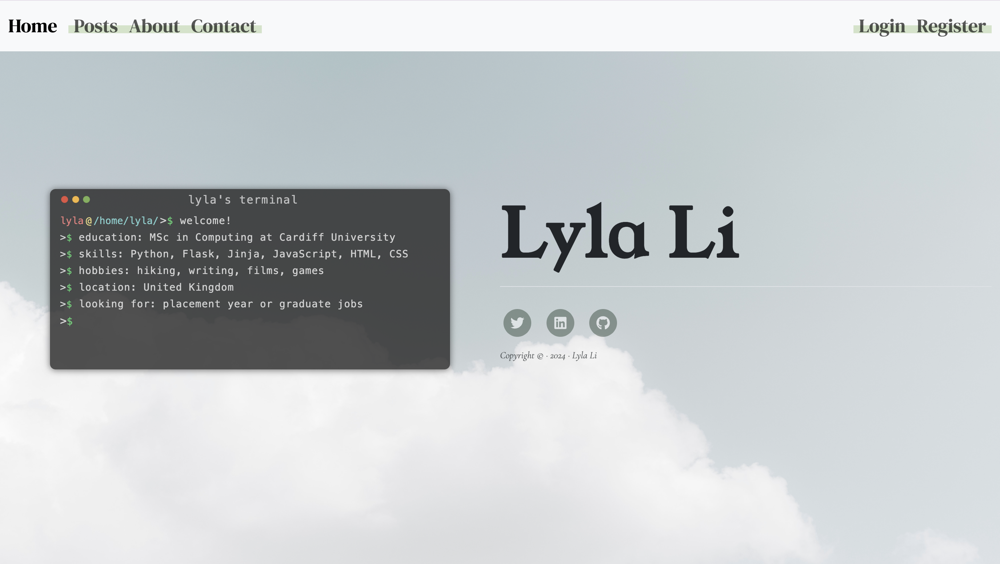

**Student Number: 22123589** \
**Website URL:** 



# My Personal Website
Welcome to my personal website built using Python and Flask!

## Table of Contents
- [My Personal Website](#my-personal-website)
  - [Table of Contents](#table-of-contents)
  - [Introduction](#introduction)
  - [Features](#features)
  - [Getting Started](#getting-started)
    - [Prerequisites](#prerequisites)
    - [Installation](#installation)
  - [Usage](#usage)
  - [Customization](#customization)
  - [Credits](#credits)

## Introduction
This is a simple personal website where I write my blog, and share my contact information. It is built using the Flask web framework in Python and allows me to easily share my posts and thoughts with others.

## Features
- Blog section for writing and sharing posts.
- Contact page for reaching out to me.
- User can register to comment on my posts.
- Clean and responsive design.

## Getting Started
Follow these instructions to set up and run the website on your local machine.

### Prerequisites
Before you begin, ensure you have the following installed:
- Python 3.x
- Flask (install via `pip install Flask`)

### Installation
1. Clone this repository:
   ```bash
   git clone https://git.cardiff.ac.uk/c22123589/personal-website.git
   cd personal-website
   ```
2. Create a virtual environment:
   ```bash
    python -m venv venv
    source venv/bin/activate 
   ```
3. Install dependencies:
   ```bash
    pip install -r requirements.txt
   ```
## Usage
1. Run the Flask app:
   ```
   python3 main.py
   ```
2. Open your web browser and go to http://localhost:5000 to view the website.
3. Delete the database and create a new one of your own. You can modify the database schemes to meet your needs.
4. You can customize the content by editing the templates and static files in the templates and static directories.

## Customization
- Update the content in the templates directory to customize the pages.
- Modify the CSS in the static/css directory to change the website's styling.
- Write blog articles in the blog section.
- Change About and Home page text in txt files nested in the text directory.

## Credits
The following code and resources have been used in this project:

- [Bootstrap](https://getbootstrap.com/) for styling (License: MIT License)
- [Font Awesome](https://fontawesome.com/) for icons (License: Font Awesome Free License)
- [jQuery](https://jquery.com/) for DOM manipulation (License: MIT License)
- Code snippets from various sources as mentioned below:
  - The "home.js" module by Rish Bhardwaj (https://github.com/crearo/portfolio/blob/main/static/js/home.js) 
  - The "scripts.js" module by Start Bootstrap (https://github.com/StartBootstrap/startbootstrap-clean-blog/blob/master/dist/js/scripts.js) 
  - The "home.css" file by Rish Bhardwaj (https://github.com/crearo/portfolio/blob/main/static/css/home.css) 
  - The "styles.css" file by Start Bootstrap (https://github.com/StartBootstrap/startbootstrap-clean-blog/blob/master/dist/css/styles.css) 
  - The "home.html" file by Rish Bhardwaj (https://github.com/crearo/portfolio/blob/main/templates/home.html) 
  - The "index.html" file by Start Bootstrap (https://github.com/StartBootstrap/startbootstrap-clean-blog/blob/master/dist/index.html) 
  - The "contact.html" file by Start Bootstrap (https://github.com/StartBootstrap/startbootstrap-clean-blog/blob/master/dist/contact.html) 
  - The "about.html" file by Start Bootstrap (https://github.com/StartBootstrap/startbootstrap-clean-blog/blob/master/dist/about.html) 
  - The "post.html" file by Start Bootstrap (https://github.com/StartBootstrap/startbootstrap-clean-blog/blob/master/dist/index.html) 


